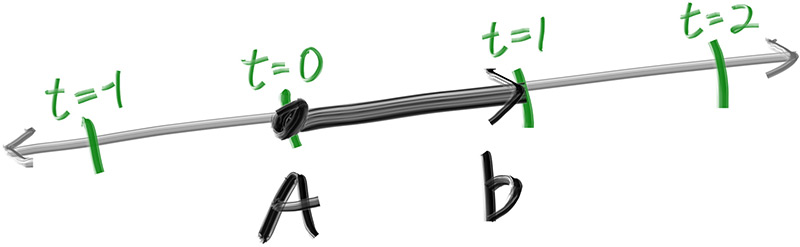
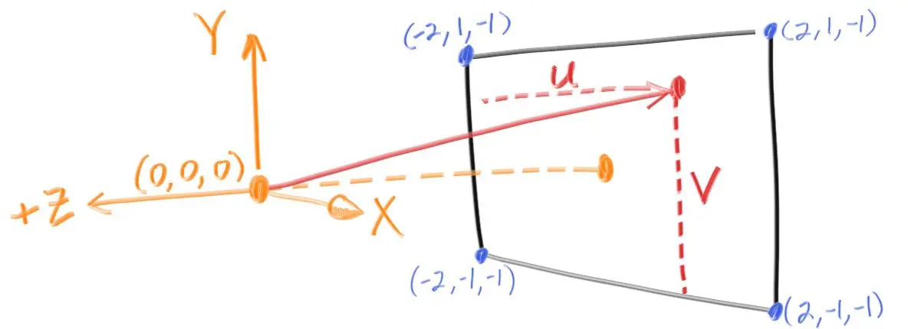

# Класс луча

У всех трассировщиков лучей есть класс лучей и вычисление цвета вдоль луча. Представим луч как функцию $P(t)=A+tb$. Здесь $P$ представляет собой трехмерное положение вдоль линии в $R^3$. `A` является источником луча и $b$ является направлением луча. Параметр луча $t$ является действительным числом (`double` в коде). Для положительных $t$, вы получаете только те части, которые находятся перед `A`, и это то, что часто называют полулинией или учом.



Представим луч как класс с методом `::at(t)`, которая представляет собой функцию $P(t)$.

1. Создайте класс `ray`, который содержит:
- Конструктор по-умолчанию
- Конструктор от $A$ и $b$, которые задаются классом `vec3`
- Метод `at`, который принимает $t$ и возвращает `vec3`
- Вспомогательные методы, которые возвращают начало и направление луча
- Подумайте что будете хранить в качестве полей класса

# Посылка лучей на сцену

По своей сути трассировщик лучей посылает лучи через пиксели и вычисляет цвет, видимый в направлении этих лучей. Необходимые шаги:

1. Вычислите луч от “глаза” через пиксель
2. Определите, какие объекты пересекает луч
3. Вычислите цвет для ближайшей точки пересечения

Используем простую камеру для запуска кода, т.е. неподвижную и в центре экрана. Кроме того, чтобы не путать ширину с высотой будем разадавать не их, а ширину и соотношение сторон (ширина/высота), например 2:1 (не забудьте, что высота не может быть меньше 1).

В дополнение к настройке размеров в пикселях для изображения, нам также необходимо настроить виртуальное окно просмотра (т.н. `viewport`), через которое будут проходить лучи нашей сцены. Область просмотра - это виртуальный прямоугольник в 3D-мире, который содержит сетку расположения пикселей изображения. Если пиксели расположены на том же расстоянии по горизонтали, что и по вертикали, то окно просмотра, которое их ограничивает, будет иметь то же соотношение сторон, что и визуализируемое изображение.

Для начала выберем произвольную высоту видового экрана, равную 2.0, и увеличим ширину видового экрана, чтобы получить желаемое соотношение сторон. Как будет выглядеть этот код:

```cpp
auto aspect = 16.0 / 9.0;
int width = 400;

int height = int(width / aspect);
height = (height < 1) ? 1 : height;

auto viewport_height = 2.0;
auto viewport_width = viewport_height * (double(width)/height);
```
<details>
  <summary><b>Примечание:</b></summary>
  Почему просто не использовать aspect при вычислениях viewport_width? Потому, что значение, установленное в aspect, является идеальным соотношением, что может не соответствовать фактическому соотношению между width и height. Если бы height было разрешено иметь вещественное значение, а не просто целое число, тогда можно было бы использовать aspect. Но фактическое соотношение между width и height может варьироваться в зависимости от двух частей кода. Во-первых, height округляется в меньшую сторону до ближайшего целого числа, что может увеличить соотношение сторон. Во-вторых, мы не допускаем, чтобы height было меньше единицы, что также может изменить фактическое соотношение сторон.
</details>

Далее определим центр камеры: точку в трехмерном пространстве, из которой будут исходить все лучи сцены (ее также обычно называют точкой зрения). Вектор от центра камеры к центру `viewport` будет ортогонален `viewport`. Изначально установим расстояние между видовым экраном и центральной точкой камеры равным одной единице. Это расстояние часто называется фокусной длиной.

Для простоты мы начнем с центра камеры в точке `(0,0,0)`. Ось $y$ направлена вверх, ось $x$ - вправо, а ось $z$ направлена в направлении взгляда. Так как картинка имеет центр осей в левом верхнем углу, а направления обхода оси $y$ противоположно, введем два вектора направлений обхода картинки для заполнения - $V$ и $U$.



## Проверка

После написания своего класса `vec3` и класса `ray` используем для проверки функцию `write_image`. Для этого напишите функцию `color ray_color(const ray& r)`, которая будет возвращать цвет луча (пока пусть будет черный, т.е. (0,0,0)). В теле цикла функции `write_color` используйте вектора `U` и `V` для вычисления центра пикселя и направление луча. Вам может потребоваться вспомогательный код, который задаёт `viewport` и положение камеры.

<details>
  <summary><b>Спойлер:</b></summary>
<pre><code class="cpp">

    auto aspect_ratio = 16.0 / 9.0;
    int image_width = 400;

    // Calculate the image height, and ensure that it's at least 1.
    int image_height = int(image_width / aspect_ratio);
    image_height = (image_height < 1) ? 1 : image_height;

    // Camera

    auto focal_length = 1.0;
    auto viewport_height = 2.0;
    auto viewport_width = viewport_height * (double(image_width)/image_height);
    auto camera_center = point3(0, 0, 0);

    // Calculate the vectors across the horizontal and down the vertical viewport edges.
    auto viewport_u = vec3(viewport_width, 0, 0);
    auto viewport_v = vec3(0, -viewport_height, 0);

    // Calculate the horizontal and vertical delta vectors from pixel to pixel.
    auto pixel_delta_u = viewport_u / image_width;
    auto pixel_delta_v = viewport_v / image_height;

    // Calculate the location of the upper left pixel.
    auto viewport_upper_left = camera_center
                             - vec3(0, 0, focal_length) - viewport_u/2 - viewport_v/2;
    auto pixel00_loc = viewport_upper_left + 0.5 * (pixel_delta_u + pixel_delta_v);
</code></pre>
</details>

Теперь если вы все сделали правильно при замене кода внутри `ray_color` на 
```cpp
    vec3 unit_direction = unit_vector(r.direction());
    auto a = 0.5 * (unit_direction.y() + 1.0);
    return (1.0 - a) * color(1.0, 1.0, 1.0) + a * color(0.5, 0.7, 1.0);
```

У вас должен получиться градиент