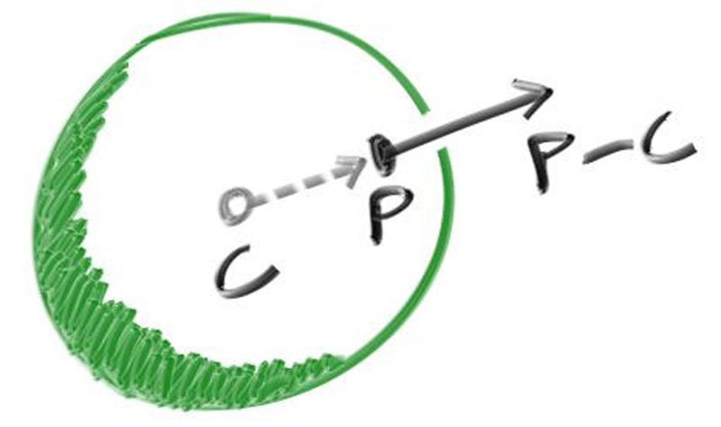
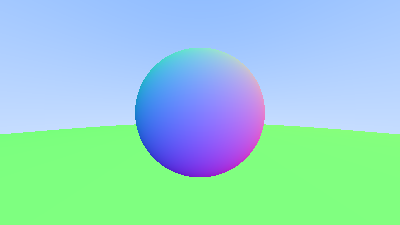

# Нормали поверхности

## Затенения

Сначала установим нормаль к поверхности, чтобы можно было затенять.

Нужно принять ключевое проектное решение для нормальных векторов: будут ли нормальные векторы иметь произвольную длину или будут нормализованы до единичной длины. Если вкратце, то примем, что нормальные вектора будут единичными, т.к. в некоторых местах далее это чуть удобнее.

Для сферы внешняя нормаль находится в направлении точки попадания минус центр:

Так как у нас пока нет никаких источников света, то визуализируем это цветовой картой. Т.к. $n$ - единичный вектор, то его компоненты находятся в пределах [-1, 1], поэтому сопоставим их с интервалом [-1, 1], а затем в цвет `rgb` как делали в самом начале проекта. Пока будем принимать за пересечение только положительные значения `t`.

Для этого измените функции `hit_sphere` и `ray_color`.

В итоге у вас должна получиться следующая картинка

## Объекты пересечения

Что если требуется более одной сфера? Хотя заманчиво иметь массив сфер, очень простое решение - создать “абстрактный класс” для всего, на что может попасть луч, и сделать как сферу, так и список сфер просто чем-то, во что можно попасть. Назовем его `hittable`.

Этот `hittable` абстрактный класс будет иметь метод `hit`, который принимает луч. Также введем некоторое ограничение на $t$, т.е. $t_{max}$ и $t_{min}$, а попадание будет считаться только в случае если выполняется $t_{min} \leq t \leq t_{max}$.

Один из вопросов архитектуры заключается в том, следует ли выполнять такие вещи, как вычисление нормы, если мы на что-то наткнемся. В конечном итоге можно наткнуться на что-то более близкое по ходу поиска, и понадобится нормаль только для ближайшей вещи. Поэтому введем вспомогательный класс `hit_record`, содержащий точку пересечения, $t$ пересечения и нормаль в точке пересечения.

1. Создайте класс `hit_record` с полями `vec3` - точка пересечения, `vec3` - нормаль, `t` - `t` пересечения

Сигнатура функции `bool hit(const ray& r, double ray_tmin, double ray_tmax, hit_record& rec)`

1. Добавьте класс `sphere`, который полиморфен `hittable`
2. Перенесите в него код вычисления пересечения.

## Направления нормалей

Нормали к поверхности могут быть направлены как "всегда наружу", так и "всегда вдоль луча". Для упрощения вычислений будем считать, что нормали всегда указывают наружу. Для определения внутри или снаружи объекта находится луч достаточно вычислить скалярное произведение направления луча и нормали. 

1. Добавьте в класс `hit_record` булево поле `front_face` - указывает снаружи или изнутри произошло пересечение
2. Добавьте в класс `hit_record` метод `void set_face_normal(const ray& r, const vec3& outward_normal)` - выставляет нормаль и направление пересечения
3. Добавьте в метод `Sphere::hit` учет этой нормали и направления

## Список объектов пересечения

Т.к. объектов пересечения может быть несколько введем класс `hittable_list`, который наследуется от `hittable` и имеет следующие поля и методы:

1. Массив объектов полиморфных `hittable`
2. Конструктор по-умолчанию
3. Конструктор от одного объекта, полиморфного `hittable`
4. Метод `clear` - очищает список
5. Метод `add` - добавляет объект в список
6. Метод `hit` - проходится по списку объектов и пытается пересечь луч с каждым из объектов, записывает пересечение для первого объекта

## Дополнительно

Можно вынести константы и необходимые функции в заголовочный файл `common.h`, например определение числа $\pi$, бесконечности, перевод градусов в радианы и обратно и некоторые общие заголовочные файлы. 

После этого можно будет включать в свои файлы не отдельные заголовочные файлы, а этот.

1. Добавьте в `write_image` мир, в котором создайте несколько сфер

Результат получится примерно такой

Сферы со следующими параметрами
1. Центр (0,0,-1), радиус 0.5
2. Центр (0,-100.5,-1), радиус 100